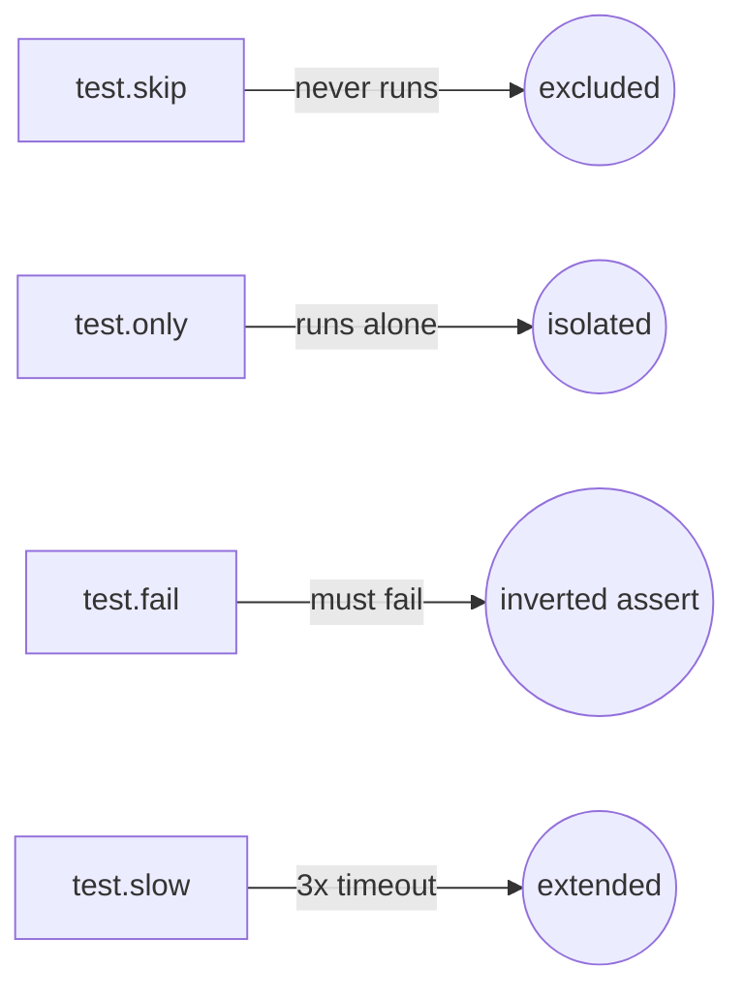
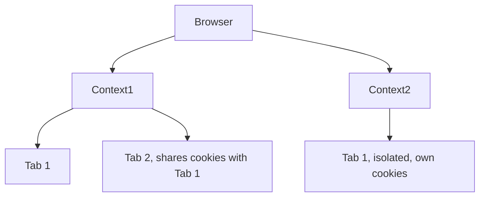
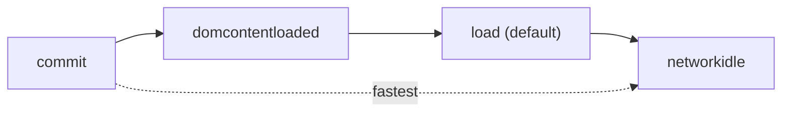

# Learning Playwright Fundamentals 2x

A hands-on starter project for learning [Playwright](https://playwright.dev/) end-to-end testing with TypeScript. Part of **The Testing Academy** Playwright Fundamentals course.

## Tech Stack

- [Playwright Test](https://playwright.dev/docs/intro) `^1.61.1`
- TypeScript / Node.js (`@types/node`)

## Prerequisites

- [Node.js](https://nodejs.org/) 18+ (LTS recommended)
- npm (ships with Node)

## Getting Started

```bash
# 1. Install dependencies
npm install

# 2. Install Playwright browsers
npx playwright install
```

## Running Tests

```bash
# Run all tests (headless)
npx playwright test

# Run in headed mode (watch the browser)
npx playwright test --headed

# Run a single spec
npx playwright test tests/example.spec.ts

# Run in UI mode (interactive)
npx playwright test --ui

# Debug a test
npx playwright test --debug
```

## Viewing the Report

After a run, open the HTML report:

```bash
npx playwright show-report
```

## Project Structure

```
.
├── tests/
│   ├── 01_Basics/                    # Test anatomy, annotations (skip/only/fail/slow)
│   ├── 02_First_tests/               # Browser → Context → Page (BCP) hierarchy
│   ├── 03_Locators_Commands/ … 23_Advance_Framework/   # Curriculum modules (scaffolded, WIP)
│   ├── Template.spec.ts              # Empty spec scaffold, copy for new tests
│   └── example.spec.ts               # Sample: title check + "Get started" navigation
├── playwright.config.ts    # Playwright configuration
├── package.json
└── .gitignore
```

## What's Inside

`tests/example.spec.ts` demonstrates two core patterns:

1. **Assertions** — verify the page title matches `/Playwright/`.
2. **Navigation + role locators** — click the *Get started* link and assert the *Installation* heading is visible.

### 01 - Test Anatomy & Annotations

**Concept:** every Playwright spec is `test(name, async ({ page }) => {...})`: `page` is a fixture, injected fresh per test, not something you create. Annotations (`.skip`, `.only`, `.fail`, `.slow`) tag a test's execution mode without touching its body.

**Why:** during dev you constantly need to isolate one test (`.only`), silence a broken one (`.skip`), or flag a known-fail (`.fail`), without commenting code out.

**Q&A: why use this?**
- **Q: What breaks if `test.only` ships to CI?** A: Every other test in that run gets skipped, most CI configs (`forbidOnly: !!process.env.CI`) fail the build to catch this.
- **Q: `.skip` vs `.fail`?** A: `.skip` never runs the test. `.fail` runs it and expects a failure, flips to an error if it unexpectedly passes.
- **Q: Can I skip conditionally?** A: Yes, `test.skip(condition, reason)` inside the test body, e.g. skip only on `firefox`.



```ts
// Conditional skip, reads browserName from the fixture
test('conditional', async ({ page, browserName }) => {
    test.skip(browserName === 'firefox', 'Not supported in Firefox');
});
```

### 02 - Browser, Context, Page (BCP) Hierarchy

**Concept:** Playwright models automation in three nested layers: one **Browser** process, many **Contexts** (isolated sessions, like separate incognito windows), each with many **Pages** (tabs). Cookies/storage never leak across contexts; pages in the same context share them.

**Why:** testing multi-user flows (admin + guest, two logged-in accounts) needs real session isolation, launching a whole new browser per user is wasteful; a new context is cheap and isolated.

**Q&A: why use this?**
- **Q: When do I need a second context instead of a second page?** A: When the two sessions must NOT share cookies/auth, e.g. admin vs. viewer logged in simultaneously.
- **Q: Does the `test()` fixture give me a context for free?** A: Yes, `{ page }` already comes with its own context. Use `{ browser }` when a test needs to spin up *extra* contexts manually.
- **Q: What's the cleanup order?** A: Reverse of creation: close pages, then contexts, then the browser.



```ts
test("two users interact", async ({ browser }) => {
    const adminContext = await browser.newContext();
    const adminPage = await adminContext.newPage();

    const guestContext = await browser.newContext();
    const guestPage = await guestContext.newPage();

    await adminPage.goto("https://app.vwo.com/#login");
    await guestPage.goto("https://app.vwo.com/#dashboard/home");

    await adminContext.close();
    await guestContext.close();
});
```

Context options (`viewport`, `locale`, `timezoneId`, `geolocation`, or a full device profile like `userAgent` + `isMobile` for mobile emulation) are passed into `browser.newContext({...})`, see [`237_BCP_Test_Options.spec.ts`](tests/02_First_tests/237_BCP_Test_Options.spec.ts).

### 03 - Locators & Commands

**Concept:** a locator (`page.locator(...)`) does not find the element immediately, it is a lazy, re-queryable reference. Playwright resolves it fresh at action time and auto-waits (strict mode: exactly one match, or it throws) until the element is actionable.

**Why:** DOM elements re-render (React/Vue re-mount, AJAX swaps content); a locator that re-queries on every action survives that churn, unlike a one-time `document.querySelector` handle.

**Q&A: why use this?**
- **Q: What is "strict mode"?** A: `locator()` throws if a selector resolves to more than one element, forcing you to narrow the selector instead of silently acting on the first match.
- **Q: CSS selector cheat sheet?** A: `#id` for id, `.class` for className, `[name="value"]` for the name attribute, bare `tag` for a tag selector.
- **Q: Why does `.fill()` succeed without a manual wait?** A: Auto-wait, Playwright polls the element until visible, enabled, and stable before firing the action.

```mermaid
flowchart LR
    A[page.locator&#40;selector&#41;] -->|lazy, no DOM query yet| B{Action called: .fill&#40;&#41;, .click&#40;&#41;}
    B --> C[Resolve selector now]
    C --> D{Strict mode: 1 match?}
    D -->|No| E[Throw]
    D -->|Yes| F[Auto-wait: visible, enabled, stable]
    F --> G[Perform action]
```



```ts
test("TC#1 - Verify VWO login error with lazy, strict, and auto-wait", async ({ page }) => {
    await page.goto("https://app.vwo.com/#login");

    const userNameField = page.locator('#login-username');
    const passwordField = page.locator("#login-password");
    const loginButton = page.locator("#js-login-btn");

    await userNameField.fill("admin@admin.com");
    await passwordField.fill("pass123");
    await loginButton.click();

    const error_message = page.locator('#js-notification-box-msg');
    await expect(error_message).toContainText("Your email, password, IP address or location did not match");
});
```

#### 03.1 - Built-in Locators (`getByRole` / `getByText`)

**Concept:** instead of CSS/XPath, Playwright ships user-facing locators that find elements the way a human or screen reader does: `getByRole`, `getByText`, `getByLabel`, `getByPlaceholder`, `getByTestId`, `getByAltText`, `getByTitle`. `getByRole` targets the accessibility role (button, textbox, checkbox) plus its accessible name.

**Why:** role/text locators survive CSS refactors and hashed class names (e.g. VWO's `C(--common-color-red) invalid-reason`), because they bind to what the user sees, not to brittle markup.

**Q&A: why use this?**
- **Q: When `getByRole` vs `getByText`?** A: `getByRole` for interactive controls (button, textbox, link, checkbox); `getByText` for plain, non-interactive content like a `<div>` error message with no ARIA role.
- **Q: Why does a bare `<div>` resist `getByRole`?** A: It resolves to the `generic` role with no accessible name, so there's nothing stable to target, `getByText` matches its visible text instead.
- **Q: How do I make an error assertion robust?** A: Prefer `getByTestId('email-error')` if devs add `data-testid`; otherwise `getByText(...)`, never the hashed CSS class.

```mermaid
flowchart TD
    Q{Element interactive?} -->|Yes| R["getByRole&#40;'textbox', {name}&#41;"]
    Q -->|No, plain text| T["getByText&#40;'...'&#41;"]
    Q -->|Has data-testid| D["getByTestId&#40;'...'&#41;"]
    R --> A[Action or assert]
    T --> A
    D --> A
```



```ts
test("signup error via built-in locators", async ({ page }) => {
    await page.goto("https://vwo.com/free-trial/");
    await page.getByRole('textbox', { name: "email" }).fill("abcd");
    await page.getByRole('checkbox').check();
    await page.getByRole('button', { name: "Create a Free Trial Account" }).click();

    // Plain <div> error: no role, match the visible text
    await expect(
        page.getByText('The email address you entered is incorrect.')
    ).toBeVisible();
});
```

#### 03.2 - Navigation Options (`waitUntil`, `referer`)

**Concept:** `page.goto(url, options)` controls *when* the call resolves via `waitUntil`: `commit` (server responded) → `domcontentloaded` (HTML parsed) → `load` (default, all resources) → `networkidle` (no requests for 500ms). `referer` sets the `Referer` header so the server thinks the user arrived from a given page.

**Why:** waiting for full `load`/`networkidle` on a heavy SPA wastes seconds when your assertion only needs the DOM, dialing `waitUntil` down speeds tests; `referer` reproduces analytics/attribution flows.

**Q&A: why use this?**
- **Q: What's the default?** A: `load`, Playwright waits for the `load` event (images, CSS, scripts) before `goto` resolves.
- **Q: When use `domcontentloaded`?** A: When you only need parsed HTML and will `await` your own locator afterwards anyway, auto-wait covers the rest.
- **Q: Why is `networkidle` discouraged?** A: It's flaky on pages with polling/websockets that never go idle, prefer web-first assertions over `networkidle`.



```ts
test("goto with waitUntil + referer", async ({ page }) => {
    await page.goto("https://app.com/page2", { waitUntil: "domcontentloaded" });
    await page.goto("https://app.com/landing", {
        referer: "https://google.com/search?q=testing+academy"
    });
});
```

#### 03.3 - Typing Char-by-Char (`pressSequentially`) & History

**Concept:** `fill()` sets an input's value in one shot; `pressSequentially(text, { delay })` types character by character, firing real `keydown`/`keyup` per key. `page.goBack()` / `page.goForward()` drive browser history.

**Why:** some inputs only react to real key events, autocomplete dropdowns, input masks, key-listeners, where `fill()` is too instant to trigger them.

**Q&A: why use this?**
- **Q: `fill` vs `pressSequentially`?** A: Use `fill` by default (fast, reliable); reach for `pressSequentially` only when the UI needs per-keystroke events.
- **Q: What does `delay` do?** A: Milliseconds between keystrokes, mimics human typing so debounced handlers/suggestions fire.
- **Q: How do I go back a page?** A: `await page.goBack()`, returns a response for the previous history entry (or null if none).

```mermaid
flowchart LR
    A["fill&#40;text&#41;"] -->|one shot, sets value| V[Value set]
    B["pressSequentially&#40;text, {delay}&#41;"] -->|key by key| K[keydown/keyup per char]
    K --> E[Triggers autocomplete / masks]
```



```ts
test("type key-by-key then navigate history", async ({ page }) => {
    await page.goto("https://awesomeqa.com/practice.html");
    await page.locator('[name="firstname"]')
        .pressSequentially("the testing academy", { delay: 200 });

    await page.goto("https://app.vwo.com/login");
    await page.goBack();
});
```

## Configuration Highlights

Defined in `playwright.config.ts`:

- `testDir: './tests'` — where specs live
- `testMatch: ['tests/**/*.spec.ts']` — recurses into every numbered module folder
- `fullyParallel: true` — run test files in parallel
- `reporter: 'html'` — generate an HTML report
- `trace: 'on'`, `screenshot: 'on'`, `video: 'on'` — full debug artifacts for every run (heavier, dial back for CI)
- `headless: false`, `viewport: 1920x1080` — watch tests run during course recording
- Projects: Chromium active; Firefox and WebKit currently commented out
- CI-aware retries and workers (`process.env.CI`)

## Learn More

- [Playwright Docs](https://playwright.dev/docs/intro)
- [The Testing Academy](https://thetestingacademy.com/)

## License

ISC
